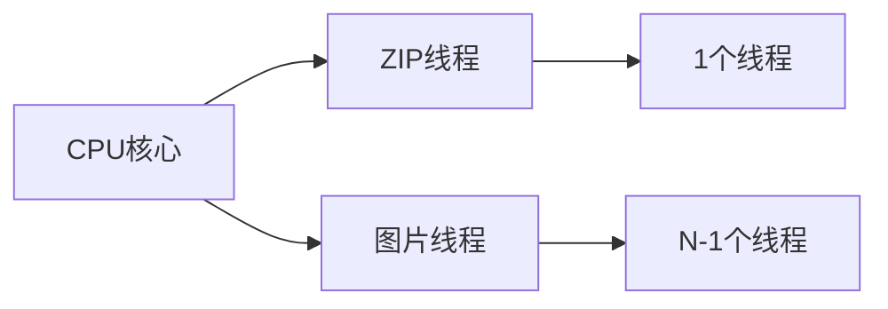

# 漫画图片压缩工具

漫画体积大、手机存不下、网络传输慢（webdav等）。压缩一下呗，一个本子就几兆，手机存得下，网络传输快，阅读流畅，爽！

## 核心价值

- 🚀 **快速处理**：多线程并行处理，充分利用CPU性能
- 📱 **移动端优化**：专为手机阅读设计的尺寸压缩
- 💾 **存储节省**：体积缩小至原文件的1/3-1/5
- 🌐 **格式支持**：支持WebP/JPG/PNG多种输出格式
- 🔄 **自动化流程**：一键完成解压→处理→打包全流程


## 快速入门

### 1. 安装依赖
```bash
git clone https://github.com/sekaiai/zip-image-processor.git
cd zip-image-processor
npm install
```

### 2. 准备文件夹
```txt
zip-image-processor/
├── input/       # 存放原始漫画压缩包
├── output/      # 保存优化后的文件
└── completed/   # 处理完成的原始文件
```

### 3. 启动处理程序
```bash
npm run start
```

### 4. 配置参数（交互式命令行）
```bash
√ 输入源文件夹路径 · ./input
√ 输出文件夹路径 · ./output
√ 完成文件夹路径 · ./completed
√ 选择输出格式 · webp        # [webp/jpg/png]
√ ZIP处理线程数 (1-12) · 1   # 推荐低频CPU使用1线程
√ 图片处理线程数 (1-12) · 11 # 推荐留1个CPU核心
√ 最大图片宽度 · 850         # 手机阅读推荐尺寸
√ 输出质量 (30-100) · 70     # 平衡画质与体积
```

## 配置详解

### 推荐配置方案

| 设备类型       | ZIP线程 | 图片线程 | 宽度 | 质量 | 格式  |
|----------------|---------|----------|------|------|-------|
| 高端手机       | 1       | 总线程 - ZIP线程 | 1080 | 75   | webp  |
| 中端手机       | 1       | 同上        | 850  | 70   | webp  |
| 低端设备/旧手机 | 1       | 同上        | 720  | 65   | jpg   |

### 参数说明

#### 输出格式
- **WebP**：最佳压缩率（推荐）
- **JPG**：兼容性最好
- **PNG**：体积最大，不建议

#### 线程配置


## 技术原理

### 处理流程
1. **解压阶段**：使用ZIP线程解压原始文件
2. **图片处理**：
   - 尺寸缩放（保持宽高比）
   - 格式转换（WebP/JPG/PNG）
   - 质量压缩
3. **重新打包**：生成优化后的压缩包
4. **清理阶段**：移动原始文件到完成目录


## 常见问题

<details>
  <summary>📁 应该选择哪种输出格式？</summary>
  
  **推荐使用WebP格式**：
  - 比JPG小25-35%
  - 支持透明度（类似PNG）
  - 现代浏览器和阅读器都支持
</details>

<details>
  <summary>⏱️ 处理速度太慢怎么办？</summary>
  
  1. 增加图片处理线程数（接近CPU核心数）
  2. 降低输出质量（70→65）
  3. 关闭其他占用CPU的程序
  4. 确保源文件和目标文件在不同物理磁盘
</details>

<details>
  <summary>📱 为什么推荐850px宽度？</summary>
  
  850px是手机阅读的黄金尺寸：
  - 主流手机屏幕宽度在1080px左右
  - 保留适当边距提供最佳阅读体验
  - 平衡清晰度和文件体积
</details>

## 项目资源

```
title: GitHub 仓库
desc: 获取最新版本和源代码
link: https://github.com/sekaiai/zip-image-processor
```

```
title: 问题反馈
desc: 提交问题或功能请求
link: https://github.com/sekaiai/zip-image-processor/issues
```

<style>
.download-btn {
  display: inline-block;
  background: var(--vp-button-brand-bg);
  color: var(--vp-button-brand-text);
  padding: 12px 24px;
  border-radius: 8px;
  font-weight: 600;
  margin: 1.5rem 0;
  transition: all 0.3s ease;
}

.download-btn:hover {
  background: var(--vp-button-brand-hover-bg);
  transform: scale(1.05);
}
</style>
